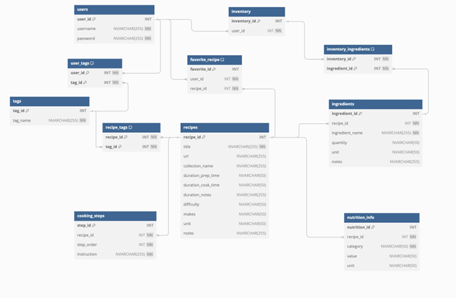

# SmartBite

## 1. Project Overview

- **Company Name**: SmartBite

- **Group 9**:
   - Miguel Matos     - 20221925
   - Patrícia Bezerra - 20221907
   - Rita Silva       - 20221920
   - Vasco Capão      - 20221906

- **Description**:  
SmartBite is an innovative startup dedicated to transforming the cooking experience through AI-powered personalisation and accessibility. The SmartBite chatbot functions as a conversational and interactive assistant, designed to simplify meal preparation for users of all skill levels. Leveraging advanced AI technologies, including Large Language Models (LLMs) and Generative AI, the chatbot offers personalized recipe suggestions tailored to individual preferences, dietary needs, and available ingredients. It aims to reduce food waste, promote healthy eating habits, and empower users with confidence in the kitchen.
The SmartBite chatbot stands out by providing real-time support, from step-by-step cooking instructions to addressing user questions instantly. Its functionality includes ingredient-based recipe recommendations and nutritional breakdowns, catering to dietary needs and promoting efficient meal planning. Whether simplifying meal planning or enhancing culinary exploration, SmartBite ensures a sustainable, inclusive, and enjoyable cooking experience for every user.

------------------------

## 2. How to Test the Chatbot

### 2.1. Prerequisites

- **Python Version**: Python 3.12.7

- **Dependencies**:
   - langchain==0.3.13
   - langchain-community==0.3.6
   - langchain-core==0.3.28
   - langchain-experimental==0.3.3
   - langchain-openai==0.2.14
   - langchain-text-splitters==0.3.4
   - semantic-router==0.0.72
   - faiss-cpu==1.9.0.post1
   - PyMuPDF==1.25.1
   - pandas==2.2.2
   - pydantic==2.8.2
   - python-dotenv==0.21.0
   - streamlit==1.41.1
   - bcrypt==4.2.1
   - transformers==4.47.1
   - tokenizers==0.21.0
   - torch==2.5.1+cpu
   - torchaudio==2.5.1+cpu
   - torchvision==0.20.1+cpu
   - scikit-learn==1.6.0
   - tqdm==4.66.5
   - regex==2024.9.11
   - openai==1.58.1

### 2.2. How to Run the Chatbot
To access the site and use the SmartBite chatbot, follow these steps:
Open the Anaconda prompt and activate the environment specified in the previous topic.
Navigate to the folder containing the ‘app.py’ file.
Once inside that folder, run the following command: ‘streamlit run app.py’
After the site opens, it is necessary to register by creating a username and password. Only after completing the registration process, it will be possible to use the chatbot.

------------------------

## 3. Database Schema

### 3.1. Database Overview and Schema Diagram
Our chatbot system’s database is designed to comprehensively manage user interactions, recipe data, and personalised user experiences. Structured using a relational database management system, it features several interconnected tables that support the chatbot’s functionality by storing information ranging from user credentials to detailed recipe instructions. Key tables include users, which store user login information; recipes, which contain comprehensive details about various recipes; and inventory, which keeps track of the ingredients each user has available. Relationships between tables are carefully defined to ensure data integrity and facilitate efficient data retrieval. For instance, the inventory_ingredients table links directly to the inventory table to allow the system to dynamically check and update users' available ingredients based on their activities within the chatbot. The schema diagram included below provides a visual representation of these relationships and structures, highlighting how data flows within the system to support both front-end interactions and back-end processes.

### 3.2. Table Descriptions
- *Users*: It is the core of the application for managing user accounts. It stores essential user information such as usernames and passwords, ensuring secure access to personalised content. This table is critical in authenticating users and enabling them to interact with the application.

- *Tags*: It maintains a repository of descriptive labels or keywords for categorising and organising content. These tags are crucial for filtering and retrieving relevant information efficiently.

- *User_tags*: It allows the system to track which tags are associated with which users, enabling personalised recommendations or tagging functionality specific to user preferences.

- *Recipes*: It is central to the application's content, containing all the recipe-related data. Each record in this table includes the recipe's title, URL, preparation time, cook time, difficulty, number of portions, and different notes. It is essential for providing users with comprehensive recipe information.

- *Recipe_tags*: As it has a many-to-many relationship between recipes and tags, it is possible to categorize recipes under multiple tags. This enables robust searching and filtering capabilities within the application.

- *Ingredients*: It maintains information regarding the specific components that are necessary for each recipe.  Each ingredient is linked to a recipe and contains information such as the ingredient name, quantity, and additional notes.

- *Cooking_steps*: It outlines the sequential steps necessary to prepare a recipe. Each step is linked to a recipe and provides step order as well as full instructions, providing users with clear assistance.

- *Nutrition_info*: It gives nutritional information for recipes, including calories, protein, fat, and vitamins. It allows users to assess the health benefits of a recipe depending on their specific dietary needs.

- *Inventory*: It acts as a repository for users to maintain a list of ingredients they possess. It is uniquely linked to each user and facilitates efficient management and tracking of their available cooking resources. This structure supports features like checking the ingredients against recipes to determine what dishes a user can cook without needing additional shopping.

- *Inventory_Ingredients*: It links ingredients to user inventories, creating a many-to-many relationship between users' available items and the ingredients table. Each entry specifies which ingredients are present in a user's inventory, supporting the system in inventory management and updating user-specific ingredient lists as they use or acquire new ingredients.

- *Favorite_Recipes*: It allows users to save their favourite recipes for quick access. By storing associations between users and their preferred recipes, the table enables personalised features such as quick retrieval of favoured recipes, allowing for a more tailored user experience within the application.

------------------------

## 4. User Intentions

### 4.1. Implemented Intentions

- **Personalized Recipe**: The users ask for recipe suggestions based on their preferences and dietary needs, such as vegan, gluten-free, or vegetarian recipes.
- **Ingredient-Based Recipe**: The users ask for recipes they can make with specific ingredients they have on hand, like chicken and rice.
- **Nutrition Information**: The users want to know nutritional details for a specific recipe or ingredient, such as calories, protein, or fat.
- **Step-By-Step Instruction**: The users want clear, step-by-step instructions for preparing a recipe, including preparation and cooking steps.
- **Nutrition Goal Sorting**: The users want to sort recipes based on specific nutritional goals, such as high protein or low calorie.
- **Recipe Difficulty Filter**: The users want to filter recipes by difficulty level, such as easy, intermediate, or advanced recipes.
- **Ingredient Update**: The users intend to add or remove ingredients from their inventory to keep it current and accurate.
- **Save Favourite Recipe**: The users want to mark a recipe as a favourite.
- **About the Company**: The users want to ask questions about SmartBite as a company, such as its mission, vision, or features.
- **None Related**: The users interact through casual small talk or unrelated discussions, exploring general topics unrelated to the SmartBite company.

### 4.2. How to Test Each Intention

- **Personalized Recipe**:
	- Can you find a vegetarian dinner recipe?
	- I'm looking for a gluten-free recipe.
	- Suggest a healthy recipe.

- **Ingredient-Based Recipe**:
	- I have chicken and curry, what can I cook?
	- What dishes can I make with Greek yogurt ?
	- I have cod and potatoes, what can I cook?

- **Nutrition Information**: 
	- Can you tell me the nutritional facts of roasted stuffed cauliflower?
	- What are the nutrients in broccoli salad?
	- What's the nutritional breakdown of burrito bowl with chipotle black beans

- **Step-By-Step Instruction**: 
	- How do I cook a rasgulla?
	- What are the steps to make a kitchari?
	- I need detailed instructions for making a porchetta.

- **Nutrition Goal Sorting**: 
	- Show me recipes with high protein.
	- Can you show me recipes with low fat?
	- Can you show me recipes with more than 300 calories?

- **Recipe Difficulty Filter**:
	- Show me hard recipes.
	- Do you know some easy recipes?
	- I'm looking for recipes with a medium skill level.

- **Ingredient Update**:
	- I have no more eggs
	- In my ingredient list add chicken
	- I've ran out of Chicken

- **Save Favourite Recipe**:
	- Let’s save rasgulla recipe to favorites.
	- Let’s remove rasgulla recipe from favorites.
    - Go ahead and save porchetta recipe to favorites.

- **About the Company**:
	- How to Use SmartBite?
	- Could you share some insights about the key features of SmartBite?
	- Does SmartBite have advanced search and filters?

- **None Related**:
	- Hi how are you doing?
	- Do you like sports?
	- What's something you've always wanted to learn?

------------------------

## 5. Intention Router

### 5.1. Intention Router Implementation

- **Message Generation**:
The messages for each user's intention were generated using synthetic data. This process leveraged Python libraries such as ‘pydantic’ for defining schemas and ‘langchain’ for crafting and processing prompts. A language model created realistic and varied synthetic messages for different chatbot intentions. The goal was to ensure that the generated data accurately represented potential user interactions while maintaining flexibility for updates.
The generated messages were stored in a structured JSON file named 'layer.json,' allowing for smooth integration with the chatbot's logic and intention routing mechanism. This approach ensured efficient data management and provided an easily accessible format for further updates or enhancements to the chatbot's capabilities.

### 5.2. Semantic Router Training

- **Hyperparameters**: 
The semantic router used the HuggingFace Encoder to generate semantic vector representations of input messages and intentions. This encoder was selected for its robust performance in capturing meaningful contextual information, which is crucial for accurately identifying user intentions.
The aggregation method employed was the ‘max’ aggregation strategy, which selects the highest value across the dimensions of the encoded representations, ensuring that the most significant features are prioritised. Additionally, the ‘top_k’ parameter was set to 5, enabling the router to retrieve and rank the top five most relevant results for each query. This configuration was tested and validated using stratified train-test splits on synthetic and newly added data, ensuring a balanced evaluation.

------------------------

## 6. Intention Router Accuracy Testing Results

### Methodology

1. **Message Creation**:
- It generated approximately 80 synthetic messages per intention. Additionally, it produced 80 messages for both small-talk related to SmartBite and off-topic messages unrelated to the company, labelled as 'None_related’.

2. **Data Splitting**:
- The dataset was split into training and testing sets (80/20), ensuring a balanced distribution of each intention across both sets.

3. **Training the Semantic Router**:
- After splitting the data, the training accuracy was evaluated at 100%, while the test accuracy reached 84.97%.

4. **Reporting Results**:

### Results

|       Intention          | Test Inputs |  Correct   |  Incorrect  |     Accuracy (%)  |
| -------------------------|-------------| ---------- | ----------- | ------------------|
| Personalized Recipe      |     16      |     14     |      2      |      87.50%       |
| Ingredient-Based Recipe  |     15      |     11     |      4      |      73.33%       |
| Nutrition Information    |     16      |     10     |      6      |      62.50%       |
| Step-By-Step Instruction |     14      |     13     |      1      |      92.86%       |
| Nutrition Goal Sorting   |     16      |     14     |      2      |      87.50%       |
| Recipe Difficulty Filter |     15      |     15     |      0      |       100%        |
| Ingredient Update        |     15      |     11     |      4      |      73.33%       |
| Save Favourite Recipe    |     16      |     16     |      0      |       100%        |
| About Company            |     15      |     15     |      0      |       100%        |
| None Related             |     15      |     11     |      4      |      73.33%       |
| **Average Accuracy**     |     153     |     130    |      23     |      85.035%      |

